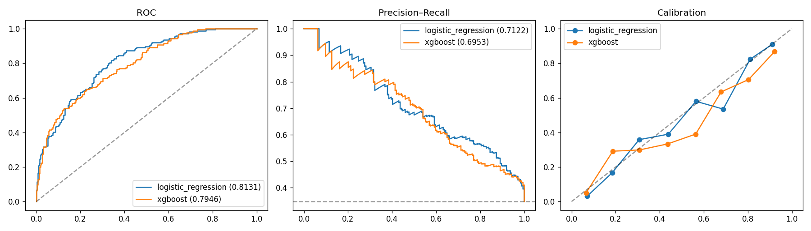
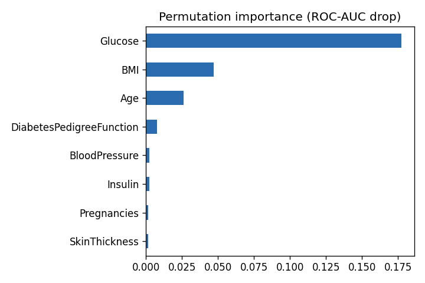
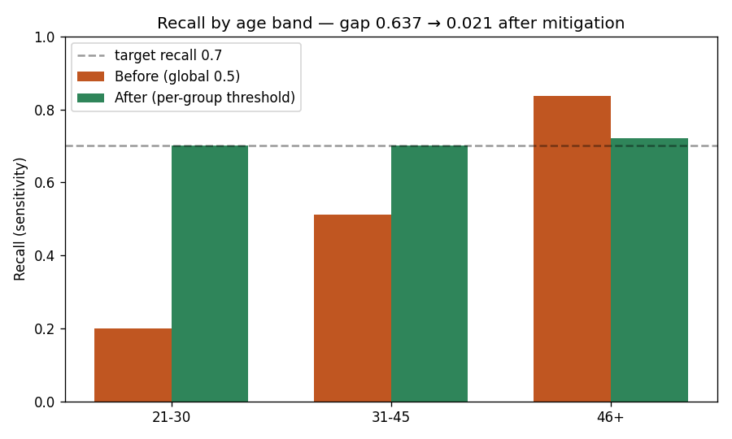

# 🩺 Diabetes Risk Prediction — with a Fairness Audit & Mitigation

A diabetes-screening model built the way a healthcare model *should* be: missing-data handling, cross-validated model selection, **calibration-method comparison**, recall-first metrics — and a **subgroup fairness audit with a working mitigation**.

[](https://github.com/danielduongg/health-risk-prediction/actions)

> **Reproducible by design** via a generator that mirrors the Pima Indians Diabetes dataset (including its signature physiologically-impossible zeros). Point it at the real CSV anytime.
>
> ⚠️ **Educational project on synthetic data — not a medical device, not for clinical use.**

## What makes it more than a toy

- **Honest model selection** — 5-fold cross-validated AUC on the *training split only*, then a single held-out test.
- **Calibration-method comparison** — sigmoid vs isotonic, chosen by Brier score (sigmoid won, 0.165).
- **Permutation importance** on the held-out set.
- **Fairness audit + mitigation** — equalized-odds / demographic-parity gaps, then **per-group thresholds** that target equal recall.
- **Model card**, **inference CLI**, **pytest**, **GitHub Actions CI**, **Dockerfile**.

## Results (held-out 25%)

| Model | CV AUC | Test AUC | PR-AUC | Recall | Precision | Brier |
|---|---|---|---|---|---|---|
| Logistic Regression (calibrated) | 0.806 | **0.813** | 0.712 | 0.58 | 0.67 | 0.165 |
| XGBoost | 0.785 | 0.795 | 0.695 | 0.57 | 0.64 | 0.173 |




Glucose, BMI and age dominate (consistent with clinical knowledge) and the probabilities are well-calibrated.

## The fairness audit — and a fix that works

A strong overall AUC can hide subgroup failures. At a single global 0.5 threshold:

| Age band | n | Prevalence | Recall | FPR | Precision |
|---|---|---|---|---|---|
| 21–30 | 43 | 0.23 | **0.20** | 0.09 | 0.40 |
| 31–45 | 365 | 0.33 | 0.51 | 0.12 | 0.68 |
| 46+ | 92 | 0.47 | **0.84** | 0.35 | 0.68 |

**Equalized-odds (recall) gap: 0.64** — the model catches 84% of true cases among older patients but only 20% among the youngest.

**Mitigation:** choosing a **per-group threshold that targets 70% recall** collapses the gap:



> **Recall gap: 0.64 → 0.02 after per-group thresholds.** Equal opportunity — an equal chance of being caught if you truly have the disease — restored. This is the responsible-AI step most portfolios skip.

## Quickstart
```bash
pip install -r requirements.txt
python main.py                 # generate -> train + calibrate -> fairness audit + mitigation
python predict.py --glucose 165 --bmi 33.6 --age 50 --pregnancies 6
pytest -q
```

## Using the real dataset
Download the [Pima Indians Diabetes dataset](https://www.kaggle.com/datasets/uciml/pima-indians-diabetes-database) as `data/diabetes.csv` (same columns); the zero→missing handling is built for it.

## Tech
Python · scikit-learn · XGBoost · pandas · matplotlib · pytest · Docker · GitHub Actions

## Layout
```
├── generate_data.py    # Pima-style generator w/ realistic missingness
├── train.py            # CV selection, calibration comparison, importance
├── fairness.py         # subgroup audit + per-group threshold mitigation
├── predict.py          # single-patient inference CLI
├── main.py             # orchestrator
├── MODEL_CARD.md       # intended use, metrics, ethics, limitations
├── test_*.py           # pytest suite
└── .github/workflows/ci.yml
```
